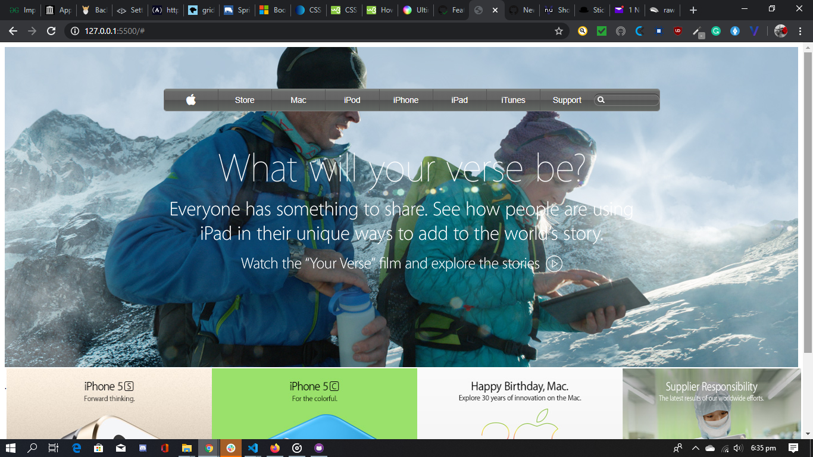

# Apple-clone

This is the fourth project of the Main HTML/CSS curriculum at [Microverse](https:www.microverse.org/) - @microverseinc

# Apple-clone ([The Odin Project](https://www.theodinproject.com/courses/html5-and-css3/lessons/backgrounds-and-gradients)

## Built With

- HTML5 
- CSS3

## Live Demo

[Live Demo](https://raw.githack.com/Temmarie/Apple-clone/feature/index.html)

## Authors

👤 **Grace Tamara Johnson E.**

- Github: [@Temmarie](https://github.com/Temmarie)

